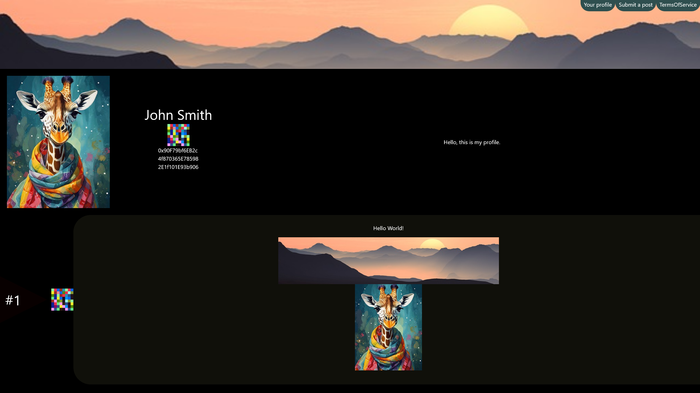

# Introduction
EVM-Social is a simple proof-of-concept social media platform built to use an arbitrary EVM blockchain as its backend. A smart contract (written in solidity) is first deployed to the blockchain of choice. This Angular app then interacts with Metamask (or compatible) wallet to read and write data to the smart contract. Pairing this with IPFS creates a true Web3 social media platform.

# Why Does This Exist?
I believe freedom of speech and privacy are fundamental human rights. If done right, this accomplishes both.

# Preview

## Explanation
Let's explain the layout starting from the top.
Here we are looking at an example profile page.
At the top, we have a banner image the user uploaded. In this case we have a nice mountain view.
## Top Row
In the top right are three buttons.
They are self explanatory. However, I will explain them anyway.
#### Your Profile
This opens a popup allowing the user to modify their profile data. Such as profile picture, banner image, display name, and description.
#### Submit a Post
Allows the user to submit a post. A popup will open guiding the user through the process of submitting a post.

#### Terms Of Service
Here are the rules and TOS. Viewable at any time.

## Middle Row
One row down, from left to right, we have
#### The profile Picture
The profile picture the user uploaded.
#### The wallet information.
This part includes their display name (if applicable), a low pixel image representing their wallet address, and their wallet address. 
The blocky image is generated to help easily differentiate between two addresses.
Lastly on this row we have the user's provided description.
Note: The wallet address in this example is the default hardhat address. If you want to send me coins, see the address toward the bottom of this page, do not use this one.
## Remaining Rows
Finally we have the posts. In the case of a user, it's their posts. In the case of a non-user page, it's the posts made by anyone on this page.
Each post have three items, from left to right we have
#### The post number
Higher is more recent.
#### Wallet Identifier Image
The wallet image mentioned earlier.
#### The Post
Finally we have the actual post. In this case this user posted some text and two images.
Hovering the mouse over the triangle will tell you the date and time the post was submitted.
Hovering over the wallet identifier image will show their full wallet address.


# Features

## Uncensorable 
All posts are stored on the blockchain in an immutable way. They cannot be edited, removed, or censored.
## Truly Decentralized
Since the backend exists on the blockchain and the front end exists on IPFS, this project is decentralized and with enough support, cannot be taken down.
## Freedom of Speech
Since posts cannot be censored, you are free to speak your mind.
## Anonymous (If done correctly)
While blockchain transactions can be traced. If done correctly, those in danger of being targeted for posting something can speak their mind.
## Privacy from IPFS Server
This app utilizes [URI Fragments](https://en.wikipedia.org/wiki/URI_fragment) to keep specific actions private from the IPFS node. Fragments are normally not sent to the server.


# How to access
To use this project, you will need the IPFS link and Metamask.
Either run your own IPFS node or use a public IPFS node.
See below for live deployments.

# How to use
When you visit the page for the first time, you will be prompted to read the Terms of Service. In order to use the app, you must accept the TOS. 
Once accepted, the TOS will close and load the default page (home).
If anyone has posted here, you will be able to scroll through their posts.
This is what the url will look like.
```url
ipfs://CID/#contract=CONTRACTADDRESS&tag=PAGE
```
If you are using a public IPFS node, it will look something like
```url
https://ipfs.io/ipfs/CID/#contract=CONTRACTADDRESS&tag=PAGE
```
There are two notable parts of the url. CONTRACTADDRESS and PAGE.

## CONTRACTADDRESS
This is the contract address of the backend smart contract. If you are using my contract, this can be excluded as the default should work. If you are using a custom contract address, fill that here. It should be in the format of 0x1234567890abcdef1234567890abcdef12345678

## PAGE
This is the "page" that you are viewing. There are two scenarios

### You are viewing a user's profile
Only the user may post to their own profile. 

### You are viewing a public space
If the PAGE is not a user's profile. Anyone may post here. In terms of reddit, think of this as a subreddit.
The default page is "home".


# Live Deployments
Below is a list of blockchains and their corresponding contract addresses.
## Contract Addreses

| Blockchain        | Type    | Address
| :----------       | :-----: | -----
| Mumbai            | Testnet | 0x6ef1c0dd6db23521442a6fc68f161b82ae89baa9


## IPFS Links
| Version | CID
| :-----  | ----
| 0.9.0 | QmTxAmmKNevA5zN5P6ffwpFbW1iw8Drw2Ghr7QcvRBg2QU

### Recommended Pages
| Page | Description
| --- | ---
| home | This is the default page.
|0xD174e332fA54261501a755B95fbF48E244674f28 | The creator's profile.

```url
ipfs://QmTxAmmKNevA5zN5P6ffwpFbW1iw8Drw2Ghr7QcvRBg2QU/#tag=home
```
```url
ipfs://QmTxAmmKNevA5zN5P6ffwpFbW1iw8Drw2Ghr7QcvRBg2QU/#tag=0xD174e332fA54261501a755B95fbF48E244674f28
```


# How It Works - Technical Details

## Posting
When you post something to this social media platform, data is stored in [event logs](https://medium.com/mycrypto/understanding-event-logs-on-the-ethereum-blockchain-f4ae7ba50378).
This drastically reduces posting cost and makes the post immutable and permanent.
Additionally, post numbers and the block number they are stored on is stored in the contract.

## Reading Posts
The steps to read posted data are as follows
1. Fetch the nonce for this page.
2. Fetch the block id(s) for the posts.
3. Use eth_getTransactionReceipt to fetch the logs for each of these block numbers.
4. Decode the block's log using the provided ABI.
5. Decode the post.

Each page has its own nonce, denoting the number of posts there.
The post ids are stored in the contract along with the block id it occurred in.
Since the post numbers are stored in the contract. We pull the post ids and their block numbers. Then call eth_getTransactionReceipt to get the logs. The post data is then decoded and used in the web app.
Posts are stored in the following format
```txt
Text block 1
--- START IMAGE ---
/9j/4AAQS...u+qvffU//9k=
--- END IMAGE ---
Text block 2
--- START IMAGE ---
/9j/4AAQS...u+qvffU//9k=
--- END IMAGE ---
Text block 3
```
Text stored between the start and end sections denote jpgs stored in base64.
Text between those image blocks are plain text.

## Profile Metadata
Display name, description, profile picture, and banner images are stored in the same way as posts. Images are stored in base64. They are accessed via a different but similar function.

# Limitations

## Immutability
Because all data is stored as events, no data can be modified or deleted.

## Gas Limits
The gas limit per block on each EVM chains varies drastically.
Some blockchains only offer 15M (1.5x10^7) gas (AVAX testnet), whereas some chains offer extremely high limits such as Aurora's limit of 9 quadrillion (9x10^15).
This naturally imposes limits on the size of our posts.
For reference, a 41KB image costs 1.4Mil (1.4x10^6) gas to post.


## Cost
Here's the most practical limitation users will encounter. Each post will cost a certain amount of coins. Unfortunately, coin prices fluctuate over time. If a coin's price rises too high, it could make posting on that blockchain too expensive. For example, this project is not feasible on Ethereum mainnet. The same 1.4Mil gas post on Ethereum would cost 
`$3,634 * 1.4x10^6 * 20 Gwei = ~$102`
However, on Polygon, the numbers change by a few orders of magnitude. 
`$1.1 * 1.4x10^6 * 38 Gwei = ~$0.059`
The general formula is as follows
`Coin price * gas used * gas price / 1,000,000,000 = Cost in USD (or used currency)`

## Trace Methods
There are some RPC calls that allow tracing multiple blocks at a time. While this would be a great option for fetching many posts at once, there are a few problems with it.
1. Size - Fetching large amount of posts with images may result in extremely large response. Many nodes likely will not support this.
2. Too large of a range - Some public nodes limit the range you can request.
3. Some nodes do not allow tracing - Tracing is an expensive call and is not always available.

# Development
This portion of the project is simply an Angular project. Install npm, install Angular, clone this repo, run npm install, run ng serve. You may need to use npm install --legacy-peer-deps

# Support

#### Funding
If you’d like me to deploy this to a blockchain of your choice, send the deployment cost to 0xD174e332fA54261501a755B95fbF48E244674f28. It costs ~2mil gas to deploy. Please contact me before sending.
If you'd like to support me, feel free to use the same wallet address.

#### IPFS pinning
Anyone can pin an ipfs folder. Pinning the folder ensures its continued existence. The entire webapp is approximately 2MB.

# License
TODO

# Smart Contract
The smart contract (solidity) will be uploaded at a future date.

# Privacy Disclaimer
Some public Web3 enabling servers collect information, sometimes just in logs, sometimes more.
## Blockchain
Some public blockchain nodes may collect usage information. If you desire privacy, these should be avoided.
## IPFS
Similar to above, some IPFS nodes collect usage data.
## Coin Tracing
All coin transactions on the blockchain are publicly traceable. 
